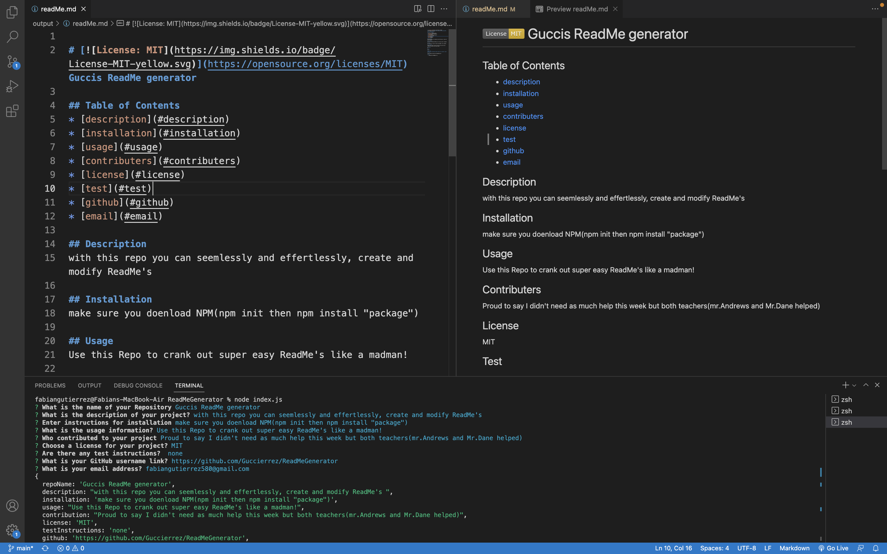

# Guccis ReadMe generator

## Table of Contents  
* [description](#description)  
* [installation](#installation) 
* [usage](#usage)  
* [contributers](#contributers) 
* [github](#github)  
* [email](#email)  

## Description
with this repo you can seemlessly and effertlessly, create and modify ReadMe's 

## Installation
make sure you download NPM(npm init then npm install "package")

## Usage
Use this Repo to crank out super easy ReadMe's like a madman!

## Contributers
Proud to say I didn't need as much help this week but both teachers(mr.Andrews and Mr.Dane helped)

# Questions
#### for more information please contact me on github or email

## Github
https://github.com/Guccierrez/ReadMeGenerator

## Email
    fabiangutierrez580@gmail.com
